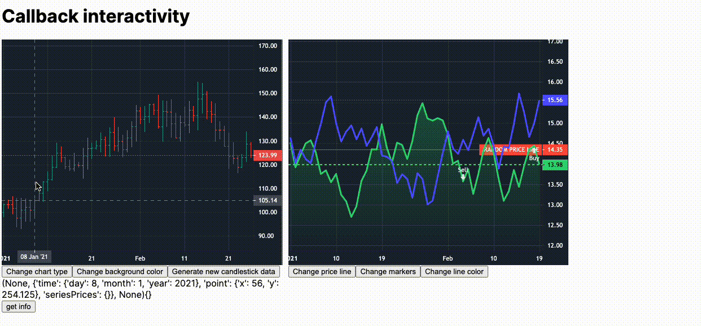

<div style="text-align: center">
<h1>🎛 Dash Tradingview Lightweight Charts Component 📊</h1>

[Source Code](https://github.com/tysonwu/dash-tradingview) | [Documentation](https://dash-tradingview.readthedocs.io/) | [Demo](http://tysonwu.pythonanywhere.com/)

</div>

Dash Tradingview Lightweight Charts Components is a Dash component library. This component wraps [TradingView's Lightweight Charts](https://github.com/tradingview/lightweight-charts), the popular financial charting library written in Javascript, and extends it for use in Python [Dash](https://dash.plotly.com/) webapp.

## Releases

| Date        | Tag    |
| ----------- | ------ |
| 23 Feb 2023 | v0.1.1 |

## Installation

This package is available in PyPI:

```
pip install dash_tvlwc
```

## Demo

### Interactive demo

An interactive demo hosted and available [here](http://tysonwu.pythonanywhere.com/).

>> The demo hosting on pythonanywhere somehow suffers from very slow callbacks. Fixing this soon.

### Chart and series style options
- 1-to-1 chart and series option capability as in original lightweight chart
- See `./example/options.py`


### Interactivity with [Dash callbacks](https://dash.plotly.com/basic-callbacks)
- Modify data or styles on any triggers
- See `./example/interactivity.py`


### Minimal example

1. Import dependencies
```python
import dash
from dash import html
import dash_tvlwc
```

2. Make some random candlestick data and line plot data
```python
candlestick_data = [
    {'close': 97.56, 'high': 101.29, 'low': 95.07, 'open': 100, 'time': '2021-01-01'},
    {'close': 96.06, 'high': 99.06, 'low': 95.17, 'open': 97.56, 'time': '2021-01-02'},
    {'close': 92.06, 'high': 98.39, 'low': 90.72, 'open': 96.06, 'time': '2021-01-03'},
    {'close': 95.74, 'high': 97.87, 'low': 89.75, 'open': 92.06, 'time': '2021-01-04'},
    {'close': 92.44, 'high': 97.5, 'low': 88.56, 'open': 95.74, 'time': '2021-01-05'},
    {'close': 89.31, 'high': 93.1, 'low': 85.20, 'open': 92.44, 'time': '2021-01-06'},
    {'close': 85.10, 'high': 93.08, 'low': 82.23, 'open': 89.31, 'time': '2021-01-07'},
    {'close': 81.87, 'high': 88.34, 'low': 77.97, 'open': 85.10, 'time': '2021-01-08'},
    {'close': 79.55, 'high': 82.44, 'low': 76.08, 'open': 81.87, 'time': '2021-01-09'},
    {'close': 82.74, 'high': 84.01, 'low': 78, 'open': 79.55, 'time': '2021-01-10'}
]

line_data = [
    {'time': '2021-01-01', 'value': 100.35},
    {'time': '2021-01-02', 'value': 97.09},
    {'time': '2021-01-03', 'value': 95.74},
    {'time': '2021-01-04', 'value': 98.72},
    {'time': '2021-01-05', 'value': 100.3},
    {'time': '2021-01-06', 'value': 95.8},
    {'time': '2021-01-07', 'value': 91.22},
    {'time': '2021-01-08', 'value': 94.26},
    {'time': '2021-01-09', 'value': 94.9},
    {'time': '2021-01-10', 'value': 94.85}
]
```

3. Initialize Dash app and add the Tvlwc component
```python
app = dash.Dash(__name__)
app.layout = html.Div(children=[
    dash_tvlwc.Tvlwc(
        seriesData=[candlestick_data, line_data],
        seriesTypes=['candlestick', 'line'],
    ),
])

if __name__ == '__main__':
    app.run_server()
```

4. Run the app by `python app2.py`. The app should be running on `localhost:8050/`. You should see the plot:


## References: Chart properties

The Tradingview Lightweight Chart library is highly customizable in style. For the complete list of chart options and series options available, please refer to [the official API document](https://tradingview.github.io/lightweight-charts/docs/api).

**Configurable props**

- `id`: identifiable ID for the chart.
- `chartOptions`: a dict of options on chart canvas.
- `seriesData`: a list series of list of timepoint dicts on series data.
- `seriesTypes`: a list of series types, in the same order as `seriesData`.
- `seriesOptions`: a list of series option dict for each series, in the same order as `seriesData`.
- `seriesMarkers`: a list of list of markers dicts for each series, in the same order as `seriesData`.
- `seriesPriceLines`: a list of list of price line dicts for each series, in the same order as `seriesData`.
- `width`: width of outer container of the chart.
- `height`: height of outer container of the chart.

**Read-only props**
- `crosshair`: position of last mouse hover on chart (crosshair coordinates).
- `click`: position of last mouse click on chart (click coordinates).
- `fullChartOptions`: full dict of applied chart options including default options.
- `fullPriceScaleOptions`: full dict of applied series options including default options.
- `timeRangeVisibleRange`: from-to dates of visible time range.
- `timeRangeVisibleLogicalRange` from-to numbers of visible time range.
- `timeScaleWidth`: width of time scale.
- `timeScaleHeight`: height of time scale.
- `fullTimeScaleOptions`: full dict of applied time scale options including default options.

## Contributing

See [CONTRIBUTING.md](./CONTRIBUTING.md)

## Development

1. Install Dash and its dependencies: https://dash.plotly.com/installation
2. Run demonstration script with `python example/usage.py`
3. Visit the demo Dash app at http://localhost:8050 in your web browser

### Install dependencies

If you have selected install_dependencies during the prompt, you can skip this part.

1. Install npm packages
    ```
    $ npm install
    ```
2. Create a virtual env and activate.
    ```
    $ virtualenv venv
    $ . venv/bin/activate
    ```
    _Note: venv\Scripts\activate for windows_

3. Install python packages required to build components.
    ```
    $ pip install -r requirements.txt
    ```
4. Install the python packages for testing (optional)
    ```
    $ pip install -r tests/requirements.txt
    ```