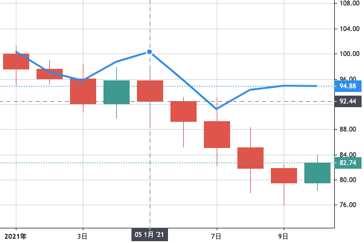

# Quickstart

## Minimal example

1. Import dependencies
```python
import dash
from dash import html
import dash_tvlwc
```

1. Make some random candlestick data and line plot data
```python
candlestick_data = [
    {'close': 97.56, 'high': 101.29, 'low': 95.07, 'open': 100, 'time': '2021-01-01'},
    {'close': 96.06, 'high': 99.06, 'low': 95.17, 'open': 97.56, 'time': '2021-01-02'},
    {'close': 92.06, 'high': 98.39, 'low': 90.72, 'open': 96.06, 'time': '2021-01-03'},
    {'close': 95.74, 'high': 97.87, 'low': 89.75, 'open': 92.06, 'time': '2021-01-04'},
    {'close': 92.44, 'high': 97.5, 'low': 88.56, 'open': 95.74, 'time': '2021-01-05'},
    {'close': 89.31, 'high': 93.1, 'low': 85.20, 'open': 92.44, 'time': '2021-01-06'},
    {'close': 85.10, 'high': 93.08, 'low': 82.23, 'open': 89.31, 'time': '2021-01-07'},
    {'close': 81.87, 'high': 88.34, 'low': 77.97, 'open': 85.10, 'time': '2021-01-08'},
    {'close': 79.55, 'high': 82.44, 'low': 76.08, 'open': 81.87, 'time': '2021-01-09'},
    {'close': 82.74, 'high': 84.01, 'low': 78, 'open': 79.55, 'time': '2021-01-10'}
]

line_data = [
    {'time': '2021-01-01', 'value': 100.35},
    {'time': '2021-01-02', 'value': 97.09},
    {'time': '2021-01-03', 'value': 95.74},
    {'time': '2021-01-04', 'value': 98.72},
    {'time': '2021-01-05', 'value': 100.3},
    {'time': '2021-01-06', 'value': 95.8},
    {'time': '2021-01-07', 'value': 91.22},
    {'time': '2021-01-08', 'value': 94.26},
    {'time': '2021-01-09', 'value': 94.9},
    {'time': '2021-01-10', 'value': 94.85}
]
```

3. Initialize Dash app and add the Tvlwc component
```python
app = dash.Dash(__name__)
app.layout = html.Div(children=[
    dash_tvlwc.Tvlwc(
        seriesData=[candlestick_data, line_data],
        seriesTypes=['candlestick', 'line'],
    ),
])

if __name__ == '__main__':
    app.run_server()
```

4. Run the app by `python app2.py`. The app should be running on `localhost:8050/`. You should see the plot:


